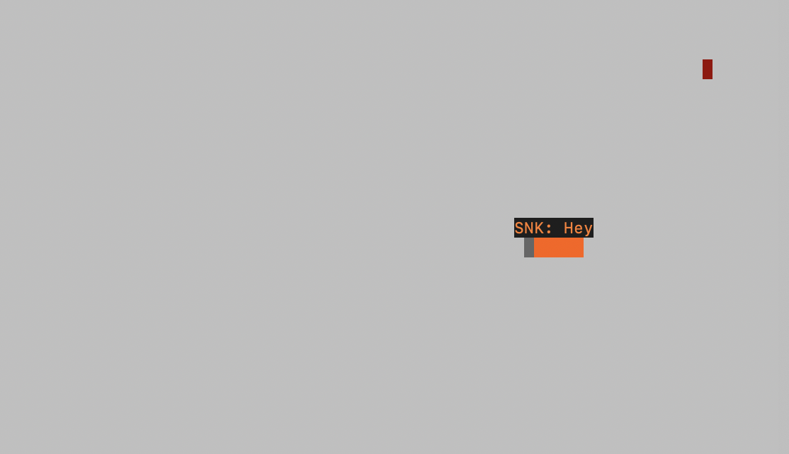
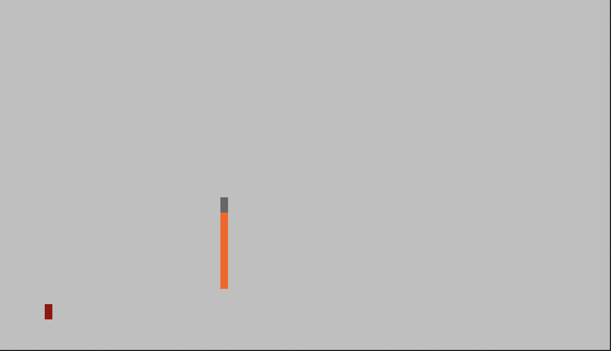
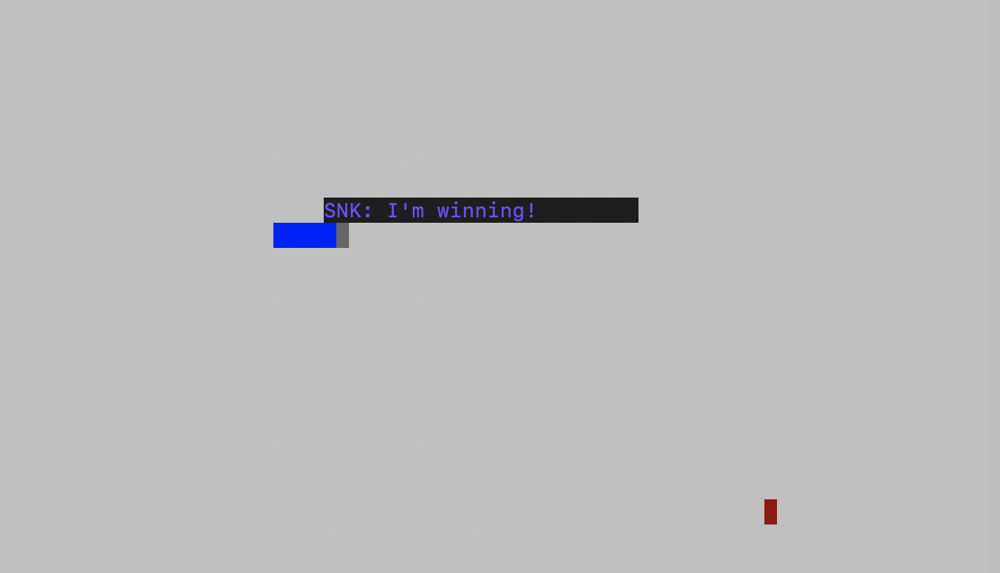

# Snake Client Project

### This a multiplayer version of the classic Snake Game. 

Snake game is a video game where the player maneuvers a snake and grows it by ‘eating’ pieces of food. As it moves and eats, it grows and the growing snake becomes an obstacle to smooth maneuvers. The objective is to grow your snake to become as big as possible without bumping into the walls, itself, or others, upon which it dies.

The Snake Server is required before you can run this client. You will need to be running the server side which you can download and install from [here](https://github.com/lighthouse-labs/snek-multiplayer). 

## Final Product

## Getting Started

- Follow steps inside the snek server repo to run the server side
- Run the development snake client using the `node play.js` command.

## Game Controls
> ### Movement
> - **W**   - up
> - **A**   - left
> - **S**   - down
> - **D**   - right
>
> ### Chat
> - **1**   - "Hello"
> - **2**   - "I'm winning!"
> - **3**   - "I'm losing!"
> - **4**   - "I don't believe you!"
> - **5**   - "Good Game!"
> - **6**   - "Goodbye!"
> 

## Contents

The Snake Client project contains four files that work together to enable a user to play the game. 

The files are:

- play.js: Used to connect to the Snake Server and connects the user input module to the client connection module.

- client.js: responsible for the client/server connection. Uses the connect() function to send and receive data from the server and decodes the encoding format.

- input.js: responsible for user input through the the handleUserInput() and setupInput() functions. which uses process.stdin and sends commands to the server via the connection object.

- constants.js: contains the name, IP address and port number for the client which will be used to connect to the server. 